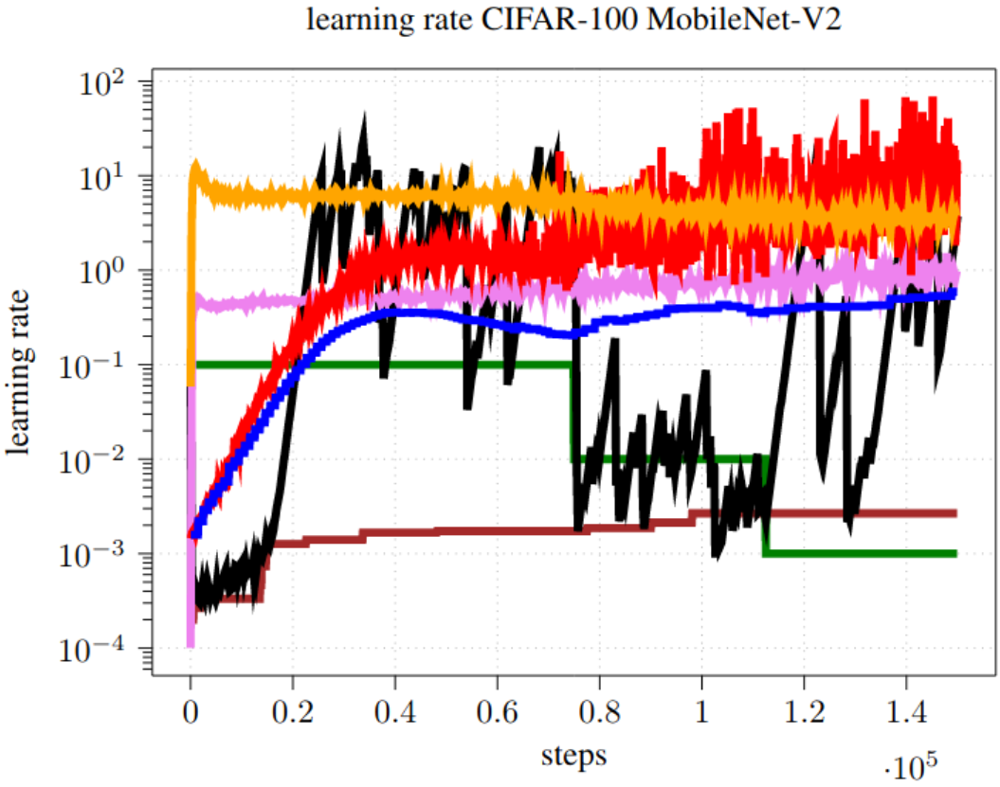
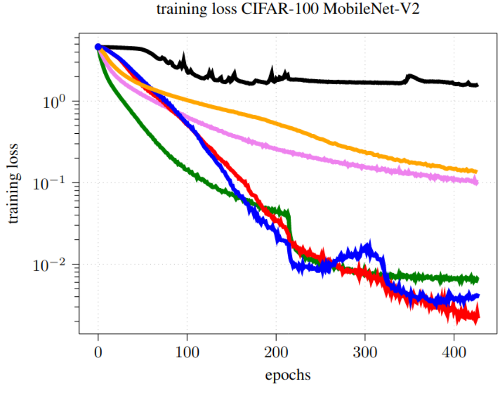

# The Large-Batch Parabolic Approximation Line Search (LABPAL) 
Implementation of the optimizer introduced in [USING A ONE DIMENSIONAL PARABOLIC MODEL
OF THE FULL-BATCH LOSS TO ESTIMATE LEARNING
RATES DURING TRAINING](https://arxiv.org/pdf/2108.13880.pdf).  
This optimizer approximates the full-batch loss in negative gradient direction with a one-dimensional parabolic function.  
This approximation is done rarely and measured with a large batch size.  
Then, the learning rate is derived form the position of the minimum of the approximation and reused for
 multiple steps. Either SGD or normalized SGD (NSGD) using the unit gradient can be used. For SGD a learning rate is measured, whereas, for NSGD the step size is measured. 
For simplification we will stick to the term learning rate in the following.   

If you have any questions or suggestions, please do not hesitate to contact me:   
maximus.mutschler(at)uni-tuebingen.de

## LABPAL reference implementation  
The LABPAL reference implementation is found in 'source/optimizer/lap_pal'.  
A closure method is needed for the 'optimizer.step()' method. This closure is given by the 'get_closure' method of the 'LABPAL' class.

### Run experiments  
- adapt the hyper parameters and paths in 'configuration_lab_pal.txt'  
- run main.py  

## The performance
LAPBAL works on the considered classification experiments without any hyper-parameter tuning needed.
In detail, the training of ResNets, MobileNets and DenseNets on CIFAR-10, CIFAR-100, SVHN and ImageNet was analyzed.  
The optimizer automatically infers suitable learning rates and keeps the gradient noise low by increasing the batch size by iteratively sampling batches.
By the dataset size and the inference batch size a noise adaptation factor is automatically estimated, which adapts the training batch size. 
The training batch size is sampled iteratively and, thus, can be higher as the technically possible inference batch size.

 <table style="width:100%">
  <tr>
     <td align=center> </td>
    <td align=center> </td>
  </tr>
  <tr>
    <td align=center></td>
   <td align=center></td>
  </tr>
Optimizer performance comparison of a MobileNet-V2 trained on CIFAR-100. 

## Limitations
Our approach can only work if the local parabolic property of the full-batch loss in line direction
holds. We observed that this is valid for classification tasks. In additional sample experiments, we
observed that our approach also works on regression tasks using the squared loss. However, it tends
to fail if different kinds of losses from significantly different heads of a model are added, as is often
the case for object detection and object segmentation.

